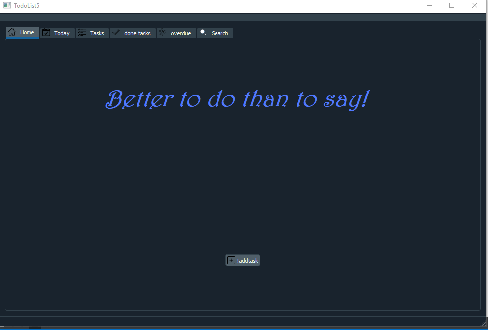
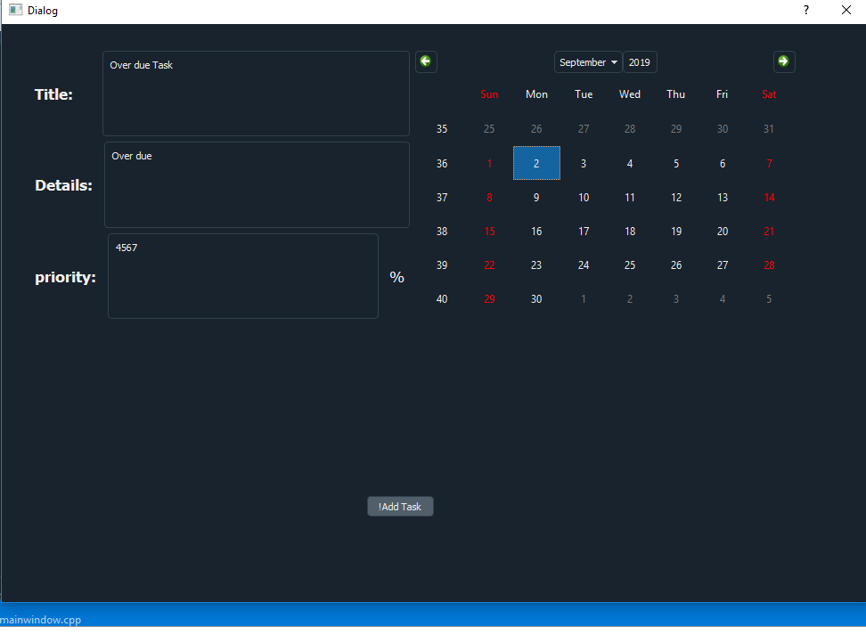
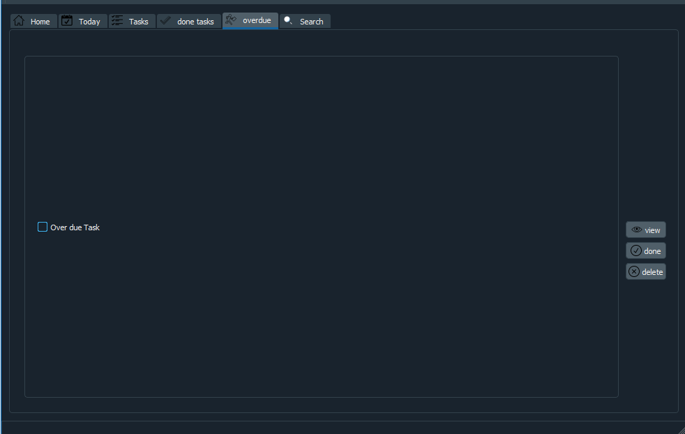
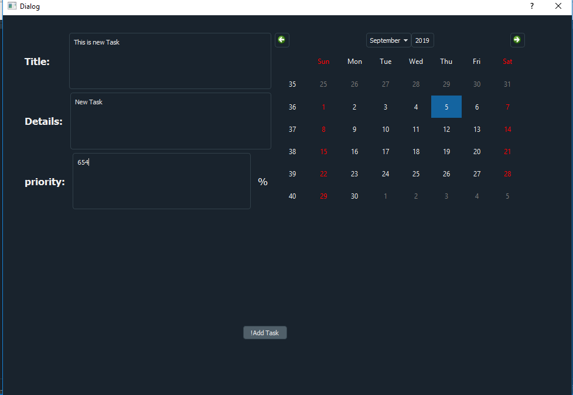
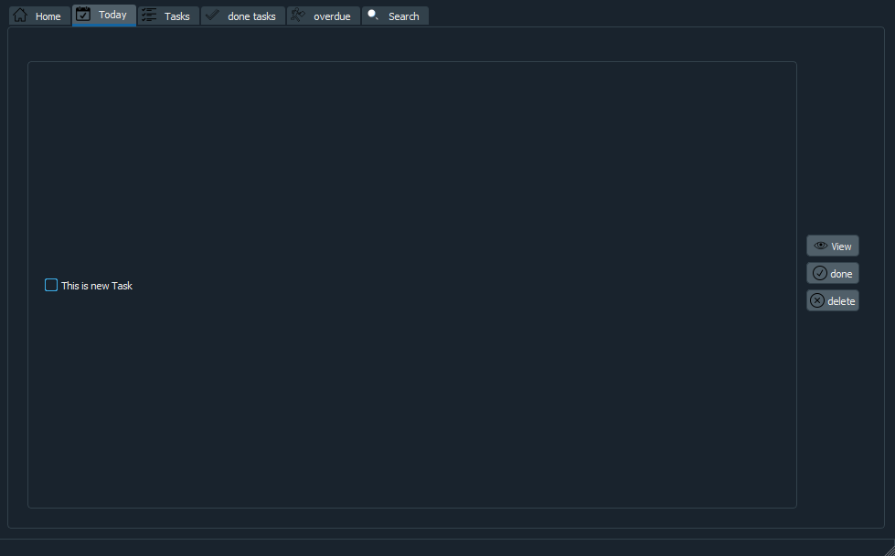
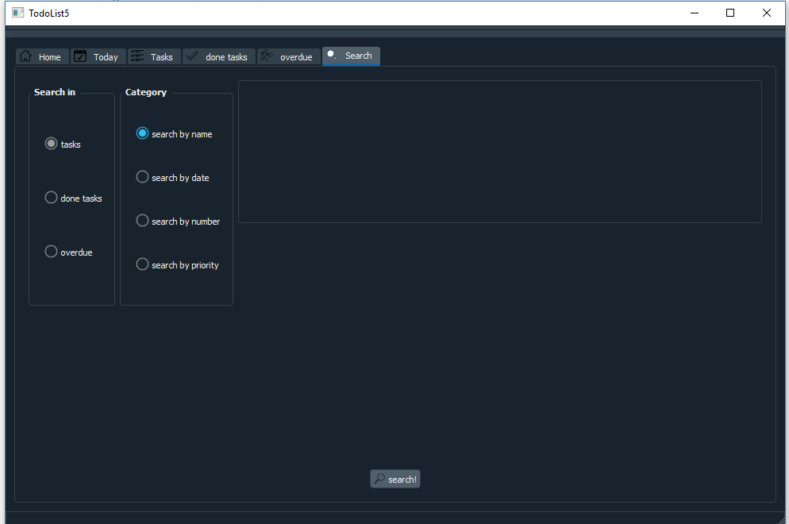

# To-dolist
To-do-list with qt c++
# Iam using sqlite database please change the pathfile of the database when u use it 
u will find database undername database.db ty for trying my to-do-list

# the home is matrial dark

# you can add today task or another day task or even overdue task with specifying the date you want 
 you can edit any task

# you can search any task and delte them

